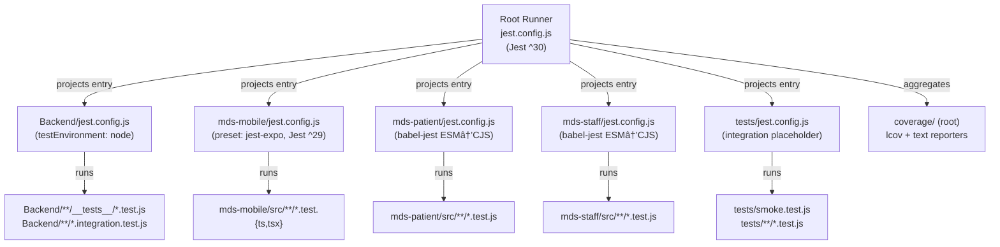

# Design Document: Root Jest Multi-Project Setup

## Overview

This design introduces a root-level Jest orchestration layer for the MDSystem monorepo. A single `jest.config.js` at the workspace root uses Jest's [multi-project runner](https://jestjs.io/docs/configuration#projects-arraystring--projectconfig) to discover and run tests across five sub-projects — Backend, mds-mobile, mds-patient, mds-staff, and a new root-level integration project — with aggregated coverage output.

The key constraint driving the design is that mds-mobile is pinned to Jest ^29 via `jest-expo`, while the rest of the monorepo targets Jest ^30. Jest's `projects` mode resolves each project against its *own* `node_modules`, so the root runner (^30) delegates to mds-mobile's local `jest-expo` transform without requiring an upgrade.

mds-patient and mds-staff are currently on `node:test`. Their tests use `import … from 'node:test'` and `import … from 'node:assert/strict'`. Migrating them to Jest requires shimming those built-in imports via `moduleNameMapper` (no test-file modifications allowed) and transpiling their ESM source via `babel-jest` + `@babel/preset-env` with `modules: 'commonjs'`.

---

## Architecture



The root runner does not own any test files itself. It is a pure orchestrator: it resolves each project config, delegates test execution, and merges coverage output into `<rootDir>/coverage`.

---

## Components and Interfaces

### Root Runner (`jest.config.js`)

Minimal configuration — delegates everything to sub-project configs.

```js
// jest.config.js (root) — illustrative shape
module.exports = {
  projects: [
    '<rootDir>/Backend',
    '<rootDir>/mds-mobile',
    '<rootDir>/mds-patient',
    '<rootDir>/mds-staff',
    '<rootDir>/tests',
  ],
  coverageDirectory: '<rootDir>/coverage',
  coverageReporters: ['text', 'lcov'],
};
```

`projects` entries are directory paths; Jest resolves each to the `jest.config.js` inside that directory. The root config sets no `testMatch`, `testEnvironment`, or `transform` — those are owned by each sub-project config.

### Root Setup File (`jest.setup.js`)

An opt-in shared setup file. Initially contains only a comment block and a commented-out opt-in example. Sub-projects that need shared globals include it in their `setupFilesAfterEnv`. Sub-projects that don't need it must not reference it (avoids unnecessary cross-project coupling).

mds-mobile already has its own `jest.setup.ts` that is essentially empty; it continues to own that file. The root `jest.setup.js` is for future use.

### Backend Config (`Backend/jest.config.js`)

Extracts the existing implicit Jest configuration from `Backend/package.json` (the `--runInBand` flag stays in the npm script, not the config). No changes to `Backend/package.json` scripts or dependencies.

Key settings:
- `testEnvironment: 'node'`
- `testMatch`: `['**/__tests__/**/*.test.js', '**/*.integration.test.js']`
- `displayName: 'backend'`
- `collectCoverageFrom`: routes and config directories, excluding node_modules and test directories
- `coverageDirectory: 'coverage'` (relative — keeps independent runs isolated)

### Mobile Config (`mds-mobile/jest.config.js`)

Migrates the inline `"jest"` block from `mds-mobile/package.json` into a standalone `jest.config.js`. Content is identical to the current inline config. After migration the `"jest"` key is removed from `package.json`.

Key settings:
- `preset: 'jest-expo'`
- `setupFilesAfterEnv: ['<rootDir>/jest.setup.ts']`
- `moduleNameMapper` entries for `expo/src/winter` and `@mdsystem/core`
- `displayName: 'mobile'`
- `collectCoverageFrom: ['src/**/*.{ts,tsx}', '!src/**/*.d.ts']`
- `coverageDirectory: 'coverage'`

The `jest-expo` preset handles all React Native transforms and environment setup. No changes to `babel.config.js` in mds-mobile.

### Patient Config (`mds-patient/jest.config.js`) and Babel Config

mds-patient has `"type": "module"` in its package.json, so its source files use ESM syntax. Jest (running in Node) cannot process ESM natively without additional configuration, so `babel-jest` + `@babel/preset-env` transpiles to CommonJS at test time.

The test files import from `node:test` and `node:assert/strict`. Jest does not know about these Node built-in test APIs, but since the test logic is self-contained (the test functions are just wrappers that `assert` directly), the approach is to shim `node:test` and `node:assert/strict` with minimal compatible implementations via `moduleNameMapper`. This avoids modifying any test files.

**Shim strategy:**

- `node:test` → a Jest-compatible shim that maps `test` and `describe` to the Jest globals of the same name
- `node:assert/strict` → a shim that re-exports `assert` from the `assert` npm package (already available in Node) in strict mode

These shims are placed in `mds-patient/__mocks__/` (and similarly for mds-staff). The `moduleNameMapper` in each project config points `^node:test$` and `^node:assert/strict$` to those shim files.

Key settings:
- `testEnvironment: 'node'`
- `transform: { '^.+\\.[jt]sx?$': ['babel-jest', { configFile: './babel.config.js' }] }`
- `testMatch: ['**/__tests__/**/*.test.js', '**/*.test.js']`
- `displayName: 'patient'`
- `collectCoverageFrom: ['src/**/*.{js,jsx}', '!src/**/*.config.*', '!src/**/__tests__/**']`
- `coverageDirectory: 'coverage'`
- `moduleNameMapper` shims for `node:test` and `node:assert/strict`

`babel.config.js`:
```js
module.exports = {
  presets: [['@babel/preset-env', { targets: { node: 'current' }, modules: 'commonjs' }]],
};
```

### Staff Config (`mds-staff/jest.config.js`) and Babel Config

Identical approach to Patient. mds-staff also has `"type": "module"` and uses `node:test` / `node:assert/strict` imports. Same shim strategy, same babel config, same Jest config shape with `displayName: 'staff'`.

### Integration Project (`tests/jest.config.js` + `tests/smoke.test.js`)

A dedicated home for cross-domain and e2e tests. Currently holds a single placeholder test. `passWithNoTests: true` prevents root runner failures if only the smoke test is present or if the directory is empty in CI.

Key settings:
- `testEnvironment: 'node'`
- `displayName: 'integration'`
- `testMatch: ['<rootDir>/tests/**/*.test.js', '<rootDir>/tests/**/*.integration.test.js']`
- `passWithNoTests: true`
- `coverageDirectory: '<rootDir>/tests/coverage'`

---

## Data Models

This feature has no runtime data models. The relevant "data" is the configuration shape of each `jest.config.js` and the package.json dependency additions.

### Dependency additions

| Sub-project | Packages added | Version |
|---|---|---|
| mds-patient | `jest`, `babel-jest`, `@babel/core`, `@babel/preset-env` | `^30.x`, `^29.x`, `^7.x`, `^7.x` |
| mds-staff | `jest`, `babel-jest`, `@babel/core`, `@babel/preset-env` | same |

> Note: `babel-jest` ^29 is compatible with Jest ^30 (the major version contract is with the Jest runner that loads it, not the host package.json). Both mds-patient and mds-staff should use `babel-jest` compatible with Jest ^30.

### File inventory

| File | Action | Notes |
|---|---|---|
| `jest.config.js` | Create | Root orchestrator |
| `jest.setup.js` | Create | Shared opt-in setup |
| `Backend/jest.config.js` | Create | Extracted from implicit config |
| `mds-mobile/jest.config.js` | Create | Migrated from package.json inline |
| `mds-mobile/package.json` | Modify | Remove `"jest"` key |
| `mds-patient/jest.config.js` | Create | New, with node:test shims |
| `mds-patient/babel.config.js` | Create | ESM → CJS transform |
| `mds-patient/__mocks__/node-test.js` | Create | node:test shim |
| `mds-patient/__mocks__/node-assert-strict.js` | Create | node:assert/strict shim |
| `mds-patient/package.json` | Modify | Add jest/babel devDeps, update test script |
| `mds-staff/jest.config.js` | Create | New, with node:test shims |
| `mds-staff/babel.config.js` | Create | ESM → CJS transform |
| `mds-staff/__mocks__/node-test.js` | Create | node:test shim |
| `mds-staff/__mocks__/node-assert-strict.js` | Create | node:assert/strict shim |
| `mds-staff/package.json` | Modify | Add jest/babel devDeps, update test script |
| `tests/jest.config.js` | Create | Integration project |
| `tests/smoke.test.js` | Create | Placeholder test |
| `package.json` (root) | Modify | Add `"test": "jest"` script |
| `.gitignore` | Verify/no-op | `coverage/` is already listed |

---

## Error Handling

**Unresolvable project path**: If a `projects` entry does not resolve to a `jest.config.js`, Jest exits non-zero and prints the unresolvable path. No additional code is required — this is Jest's built-in behavior.

**Missing babel devDependencies**: If `@babel/preset-env` is not installed when the patient or staff configs are loaded, Jest emits a transform error identifying the missing package. The fix is `npm install` inside the affected sub-project.

**node:test / node:assert/strict shimming failure**: If a shim file is malformed or the `moduleNameMapper` regex is wrong, Jest will throw at import time with the path of the failing module. The shims are kept minimal to reduce this risk — `node:test` shim exports `{ test, describe, it }` mapped to Jest globals; `node:assert/strict` shim re-exports Node's `assert` module in strict mode.

**Coverage glob matching no files**: Jest does not exit non-zero in this case by default. `passWithNoTests: true` on the integration project explicitly handles the empty-test-directory scenario.

**Jest version mismatch (mds-mobile)**: The root runner is Jest ^30. mds-mobile uses Jest ^29 via `jest-expo`. When the root runner loads `mds-mobile/jest.config.js`, it resolves `jest-expo` from `mds-mobile/node_modules`, not the root. This works because Jest's `projects` mode spawns isolated resolution contexts per project. If `mds-mobile/node_modules` is absent (e.g., after a clean install that skips mds-mobile), the root runner will emit a resolution error for the mobile project. The fix is to run `npm install` inside `mds-mobile/`.

---

## Testing Strategy

This feature is purely configuration-driven. All acceptance criteria fall into one of three categories:

- **SMOKE**: File/config existence checks (file is present at the expected path)
- **EXAMPLE**: Specific value assertions (config exports a specific field with a specific value)
- **INTEGRATION**: Runtime behavior under the Jest runner (exit codes, coverage output, project discovery)

Property-based testing does not apply. There are no universal "for all inputs, property P holds" statements to make about Jest configuration files or package.json scripts. The feature does not implement any data transformation, parser, serializer, algorithm, or business logic function.

### Unit tests (EXAMPLE / SMOKE)

Config correctness can be verified by loading each `jest.config.js` with `require()` in a test and asserting field values. This is lightweight and does not require running Jest itself.

Suggested test file: `tests/config-shape.test.js`

Key assertions to cover:
- Root config exports `projects` array with exactly 5 entries matching the expected paths
- Root config sets `coverageDirectory` and `coverageReporters` correctly
- Each sub-project config sets the correct `displayName`, `testEnvironment`, `testMatch`, and `coverageDirectory`
- `package.json` at root has `scripts.test === 'jest'`
- `mds-mobile/package.json` does not contain a `"jest"` key
- `mds-patient/package.json` and `mds-staff/package.json` have Jest and Babel in devDependencies

### Integration tests

Run as part of the smoke test suite after the feature is implemented:

1. `npm test` from the repository root exits 0 with all projects reporting
2. `npm test -- --coverage` writes output to `<rootDir>/coverage/`
3. `jest` from inside each sub-project exits 0 independently

These are best verified manually or in CI rather than as automated test cases, since they require a live Jest process and all dependencies to be installed.

---

## Correctness Properties

This feature is purely configuration-driven: it produces Jest config files, Babel configs, package.json modifications, and shim files. It contains no algorithmic data transformations, parsers, serializers, or business logic functions. Property-based testing does not apply. The correctness guarantees are expressed as structural invariants over the static configuration artifacts.

### Property 1: Root projects array has exactly five resolvable entries

The root `jest.config.js` `projects` array must contain exactly 5 entries, and each entry must resolve to a readable `jest.config.js` file at the expected sub-project path (`Backend`, `mds-mobile`, `mds-patient`, `mds-staff`, `tests`). Adding, removing, or misnaming any entry breaks this invariant.

**Validates: Requirements 1.2**

### Property 2: Sub-project coverageDirectory values are distinct from the root coverage path

Each sub-project config sets `coverageDirectory` to a path relative to its own root (e.g., `'coverage'` resolves to `Backend/coverage`). None of these paths may resolve to the same directory as the root runner's `<rootDir>/coverage` output. If any sub-project resolves coverage output to the same directory, concurrent runs will corrupt the merged report.

**Validates: Requirements 9.5**

### Property 3: node:test and node:assert/strict shims preserve the built-in API surface

The shim files mapped via `moduleNameMapper` for `^node:test$` and `^node:assert/strict$` must expose the same named exports as the real Node built-ins (`test`, `describe`, `it` for `node:test`; strict-mode `assert` and all its methods for `node:assert/strict`). Any export present in the real built-in that is absent from the shim will cause existing test files to fail at runtime. The shim must be the complete compatibility layer — no test file may be modified.

**Validates: Requirements 4.8**

### Property 4: Implementation is confined to tooling artifacts only

The implementation must touch only: `jest.config.js` files, `babel.config.js` files, `package.json` devDependency and script fields, `__mocks__` shim files, `.gitignore`, and the `tests/` integration placeholder. Any modification to application source files (`src/`, `routes/`, `config/*.js` application logic, etc.) violates this invariant.

**Validates: Requirements 10.6**
